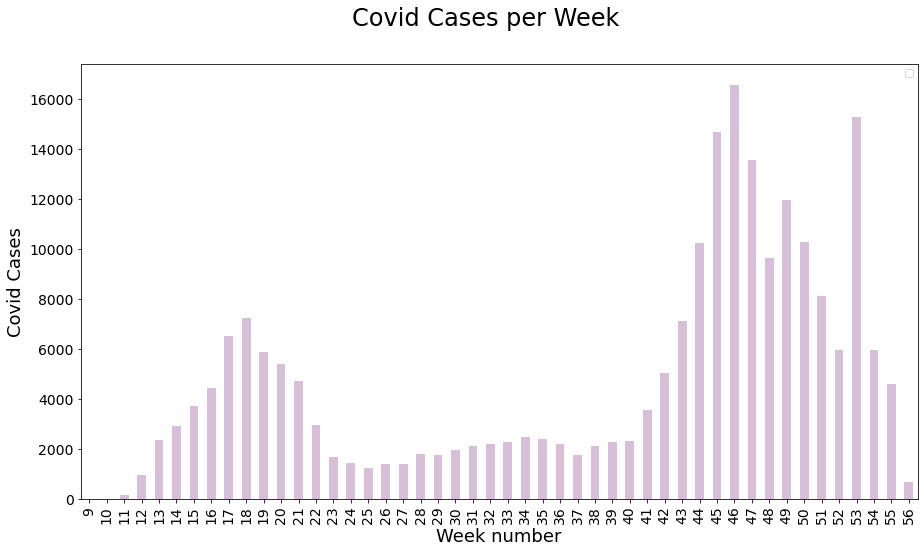
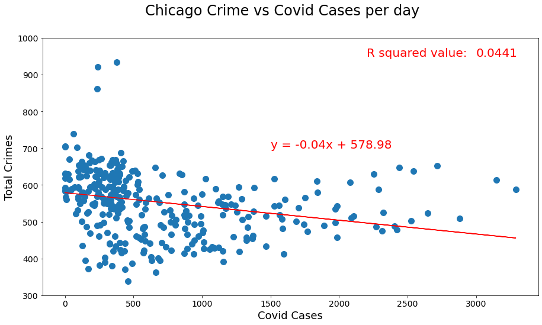
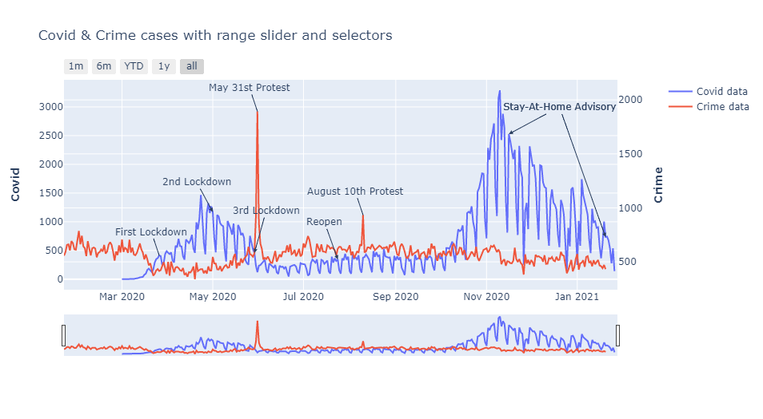
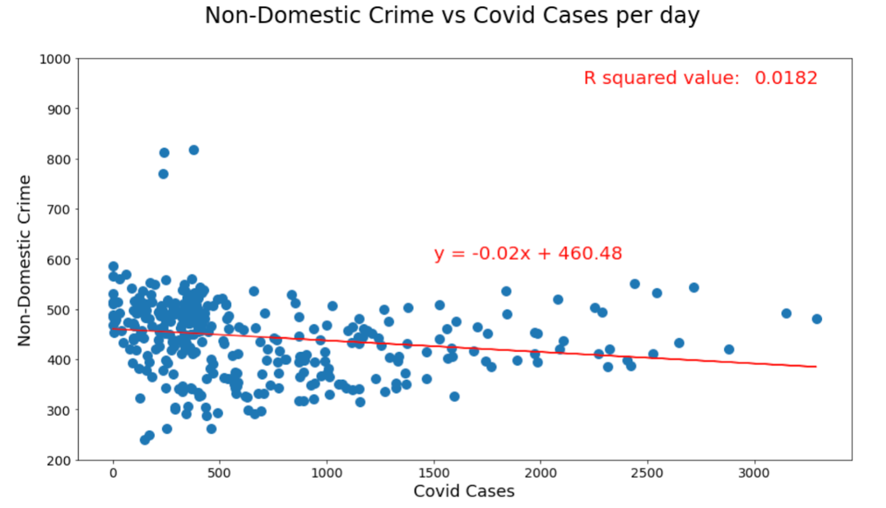
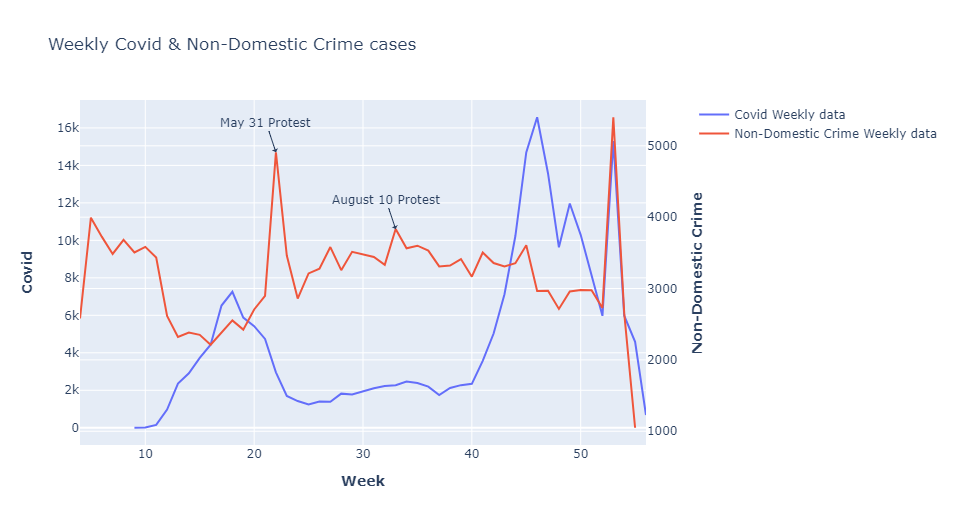
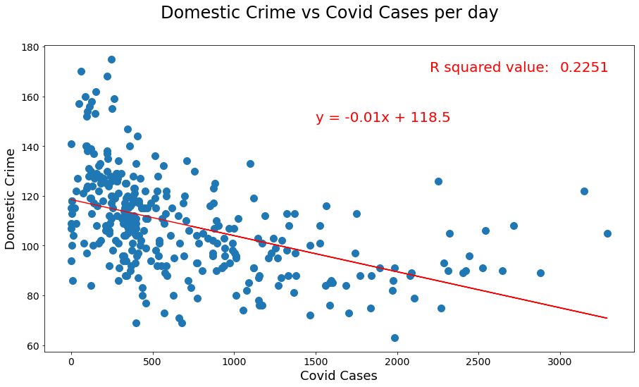
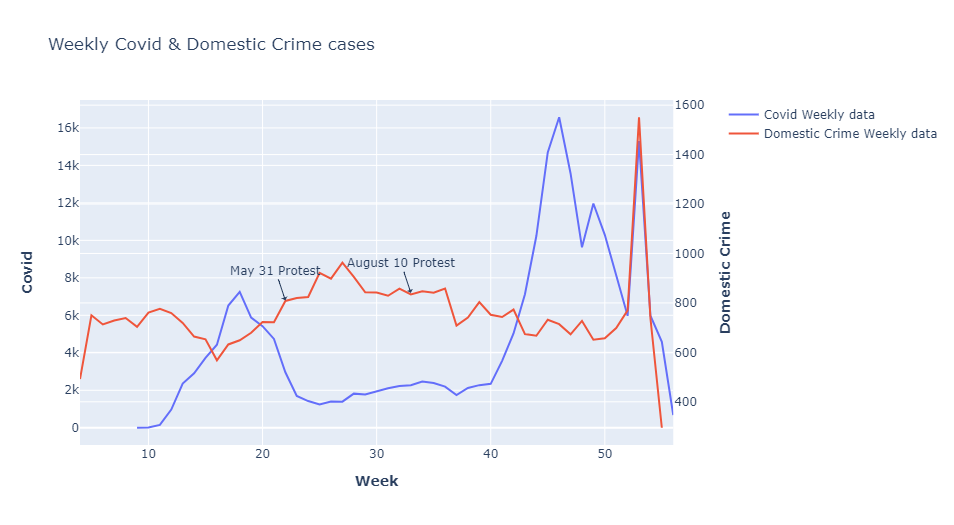

# cc-project1
#  Project: Chicago Crime

## Team Members: 
Tori Arriola,Yifei Cao, Maxim Mandel, Rana Saber	

## Project Description: 
We merged covid (https://data.cityofchicago.org/Health-Human-Services/Daily-Chicago-COVID-19-Cases-Deaths-and-Hospitaliz/kxzd-kd6a) and crime (https://www.chicago.gov/city/en/dataset/crime.html) data sets based on date and we plotted crime and covid cases for each day or each week from March 2020 to January 2021 to see if there is any relationship between covid cases and crime. 

## Questions
**Q: Which crimes are most committed in Chicago?**

A: Battery is the most commited crime in Chicago

**Q: What is the relationship between total crime and covid cases?**
A: Below we show covid cases overtime and two large covid spikes.

We see a very weak association between total crime and covid cases, with an R squared value of .0441. 
ChicagoCrimevsCovidCasesperDay.png

The crime rate decreases as the covid cases first spiked and the second covid spike didn’t have much impact on crime rate. Two spikes(protest) can be seen for crimes on May 31 and August 10

**Q: What is the relationship between nondomestic crimes and covid cases?**
A: We see a very weak association between nondomestic crime and covid cases, with an R squared value of 0.0182. 

There are wo spikes(protest) for crimes on May 31 and August 10. A bigger drop in non-domestic crime rates at the first covid spike than the domestic crime rate.

**Q: What is the relationship between domestic crimes and covid cases?**
A: We see higher R squared value of 0.2251 in these graphs, but this still shows a very weak associated between domestic crimes and covid cases. 

The two protests didn’t have impact on domestic crime rate. Similarly, covid cases didn’t have impact on domestic crime rate except when covid first spiked. The spike for both covid and domestic crime at the end is the week right after Christmas
